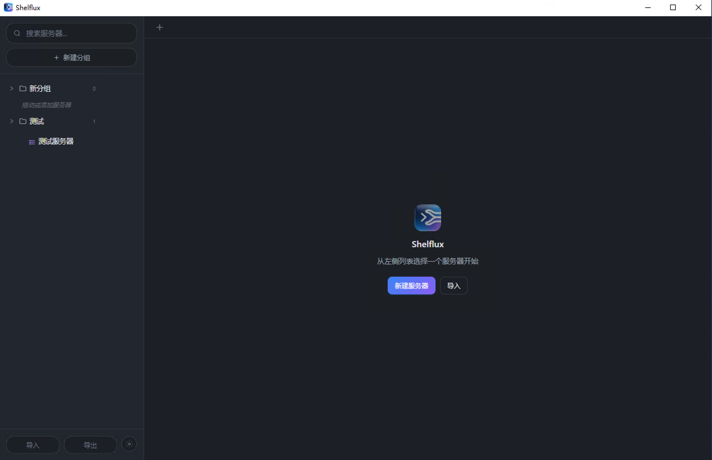
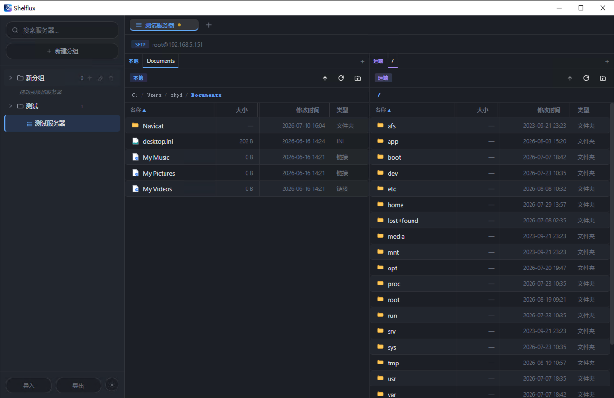
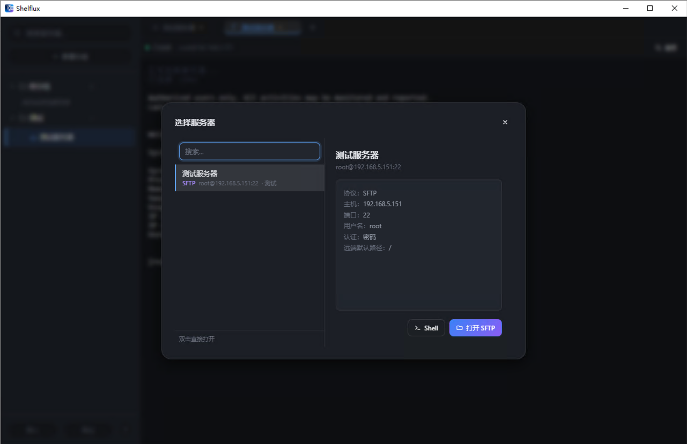
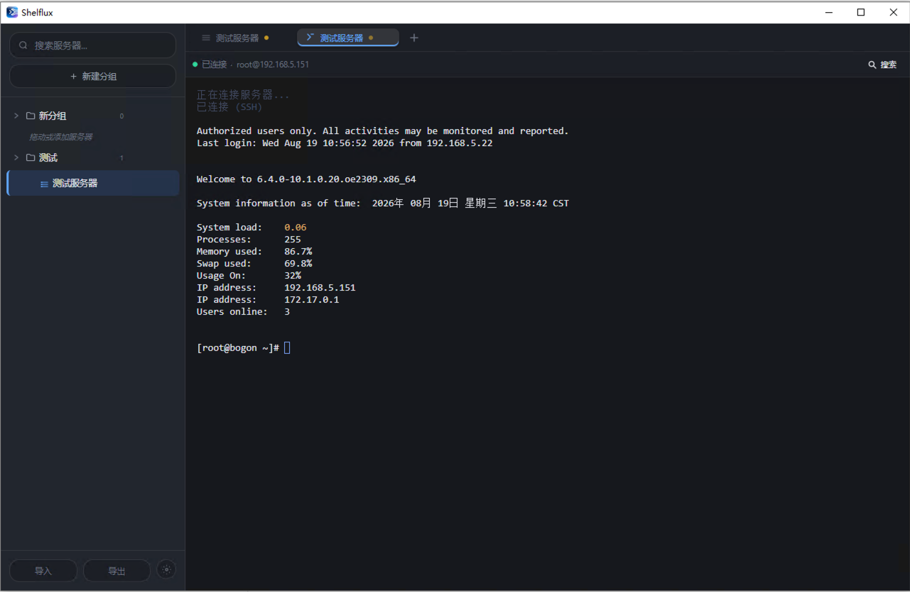

# Shelflux

> 轻量化、跨平台的多协议连接管理工具

  

## 软件截图

<div align="center">
  <br>
  <em>主界面 — 服务器分组管理，支持拖动排序与多协议连接</em>
</div>

<br>

<div align="center">
  <br>
  <em>SFTP 双栏文件管理器 — 本地/远端并排，支持拖拽传输、面包屑导航、批量操作</em>
</div>

<br>

<div align="center">
  <br>
  <em>服务器选择器 — 一键选择 Shell 终端或 SFTP 文件管理两种连接方式</em>
</div>

<br>

<div align="center">
  <br>
  <em>SSH 终端 — xterm.js 渲染，真实连接 CentOS 7 服务器，支持多页签、文本搜索、复制粘贴</em>
</div>

## 版本发布

| 版本 | 日期 | 说明 |
| --- | --- | --- |
| v0.1.0 | 2026-08-19 | 首个稳定版本 — SSH/SFTP/Telnet/Rlogin 多协议支持、SFTP双栏文件管理、服务器分组、暗/亮主题 |

## 版本说明

### v0.1.0（2026-08-19）

**全新架构与功能**

| 功能 | 描述 |
| --- | --- |
| SSH 终端 | xterm.js 渲染，支持多页签、复制/粘贴、文本搜索、字体与配色自定义 |
| SFTP 文件管理 | 本地/远端双栏并排、面包屑导航、双击或拖拽传输、传输进度、右键菜单、同侧复制、批量删除 |
| 多协议支持 | SSH / SFTP / Telnet / Rlogin 四种协议，均通过完整 RFC 实现 |
| 服务器分组 | 文件夹式管理、拖动排序、协议标记、别名 |
| 端口转发 | 本地 `-L` / 远程 `-R` / 动态 SOCKS5 `-D`，内置 SOCKS5 代理，实时连接数显示 |
| 代理连接 | HTTP CONNECT 与 SOCKS5，支持用户名密码认证 |
| 主机指纹校验 | TOFU 策略的 `known_hosts`，指纹变更时自动拒绝 |
| 暗/亮主题 | 暗色 / 亮色 / 跟随系统三档，CSS 变量驱动，终端配色同步切换 |
| 导入导出 | JSON 格式备份与恢复服务器配置 |
| 完全离线 | 所有数据本地存储，不依赖云服务 |

## 特性

- **多协议支持** — SSH / SFTP / Telnet / Rlogin
- **服务器分组** — 文件夹式管理、拖动排序、协议标记、别名
- **多页签界面** — 同时打开多个连接、点击切换、关闭
- **SFTP 双栏** — 本地/远端并排，路径面包屑、双击传输、拖动传输、传输队列、同侧复制
- **SSH 终端** — xterm.js 渲染、复制/粘贴、文本搜索、字体/颜色自定义
- **端口转发** — 本地（`-L`）/ 远程（`-R`）/ 动态 SOCKS5（`-D`）三种模式，实时连接数
- **代理连接** — HTTP CONNECT 与 SOCKS5，支持用户名密码认证
- **主机指纹校验** — TOFU 策略的 `known_hosts`，指纹变更时拒绝连接
- **暗/亮主题** — 暗色 / 亮色 / 跟随系统，终端配色同步切换
- **导入/导出** — JSON 格式备份与恢复
- **完全离线** — 所有数据本地存储，不依赖云服务
- **轻量原生** — 基于 Tauri + Rust 构建，安装包 < 15 MB

## 快捷键

| 快捷键 | 操作 |
| --- | --- |
| `Ctrl/Cmd + N` | 打开服务器选择器 |
| `Ctrl/Cmd + T` | 新建服务器 |
| `Ctrl/Cmd + W` | 关闭当前页签 |
| `Ctrl/Cmd + ,` | 打开设置 |
| `Ctrl/Cmd + Shift + L` | 打开端口转发面板 |
| `Ctrl/Cmd + F` | 在终端中搜索 |
| `Ctrl/Cmd + C` | 复制（终端中：复制选中内容） |
| `Ctrl/Cmd + V` | 粘贴（终端中：粘贴到 SSH） |

## 技术栈

- **Tauri 2** — 跨平台原生应用框架
- **Rust** — 后端，使用纯 Rust 的 `russh` + `russh-sftp` + `russh-keys`（无需系统 OpenSSL）
- **React 18** + **TypeScript** + **Vite** — 前端
- **Zustand** — 状态管理
- **xterm.js** — 终端 UI

## 当前实现状态

| 能力 | 状态 | 说明 |
| --- | --- | --- |
| SSH shell 终端 | ✅ 可用 | xterm.js 渲染、复制/粘贴、搜索、字体与配色自定义 |
| SFTP 双栏文件管理 | ✅ 可用 | 本地/远端并排、面包屑、双击/拖动传输、传输进度、右键菜单 |
| 服务器分组 / 排序 / 导入导出 | ✅ 可用 | 文件夹分组、拖拽排序、JSON 导入导出、别名 |
| 多页签界面 | ✅ 可用 | 新建/切换/关闭连接页签 |
| Telnet / Rlogin | ✅ 可用 | 裸 TCP 实现。Telnet 按 RFC 854 处理 IAC，并协商 TERMINAL-TYPE(RFC 1091)、NAWS(RFC 1073)、SGA/ECHO(RFC 858/857)，窗口变化实时上报；Rlogin 按 RFC 1282 完成握手并发送窗口尺寸控制序列。复用 SSH 终端视图与事件通道。限制：无内置密码登录 UI（登录提示由服务端在终端内交互） |
| SFTP 同侧复制 | ✅ 可用 | 本地→本地、远端→远端，目录递归复制，自动生成不冲突的副本名，覆盖前二次确认 |
| 主机指纹（known_hosts） | ✅ 可用 | TOFU：首次连接自动记录 SHA256 指纹，之后不一致即拒绝连接。设置 → 安全 中可查看/复制/删除/清空 |
| 代理支持 | ✅ 可用 | HTTP CONNECT（含 Basic 认证）与 SOCKS5（含用户名密码认证），手写实现无额外依赖。终端、SFTP、端口转发全部走同一条代理链路 |
| 端口转发 | ✅ 可用 | 本地 `-L`、远程 `-R`（含服务端自动分配端口）、动态 `-D`（内置 SOCKS5 服务端）。面板实时显示连接数与错误 |
| 暗/亮主题切换 | ✅ 可用 | 暗色 / 亮色 / 跟随系统三档，CSS 变量驱动，xterm 调色板同步切换 |

> 安装包体积目标 < 15 MB（得益于 Tauri + Rust 原生运行时，无内嵌浏览器内核）。
> 实测：NSIS 安装包 2.6 MB，MSI 4.2 MB。

### 端口转发说明

| 类型 | 等价命令 | 行为 |
| --- | --- | --- |
| 本地转发 | `ssh -L bind:port:dest:port` | 本机监听，流量经 SSH 转发到**服务端视角**可达的目标 |
| 远程转发 | `ssh -R bind:port:dest:port` | 服务端监听，流量回连到**本机视角**可达的目标（回连始终直连，不走代理，与 OpenSSH 一致）；监听 `0.0.0.0` 需服务端开启 `GatewayPorts`，端口填 `0` 由服务端自动分配 |
| 动态转发 | `ssh -D bind:port` | 本机监听为 SOCKS5 代理，目标由客户端动态指定 |

## 开发

```bash
# 安装依赖
npm install

# 开发模式
npm run tauri:dev

# 构建发布版
npm run tauri:build
```

## 目录结构

```
src/                    # 前端
├── components/         # UI 组件
│   ├── Sidebar/        # 服务器列表
│   ├── TabBar/         # 页签栏
│   ├── ServerPicker/   # 新连接选择器
│   ├── SftpView/       # SFTP 双栏视图
│   ├── SshView/        # SSH 终端
│   ├── Settings/       # 设置对话框（外观/终端/文件/安全/关于）
│   ├── Forward/        # 端口转发面板
│   └── ...
├── stores/             # Zustand 状态
├── types.ts            # 类型定义
├── utils/              # 工具函数（含 xterm 主题映射）
└── styles/             # 主题变量与全局样式

src-tauri/              # Rust 后端
├── src/
│   ├── commands/       # Tauri 命令处理器
│   │   ├── ssh.rs             # SSH shell + Telnet/Rlogin 会话与 TelnetCodec
│   │   ├── sftp.rs            # SFTP 文件操作（含同侧递归复制）
│   │   ├── local.rs           # 本地文件系统（含递归复制）
│   │   ├── client_handler.rs  # russh 事件处理 + 主机密钥 TOFU 校验
│   │   ├── known_hosts.rs     # 主机指纹持久化
│   │   ├── proxy.rs           # HTTP CONNECT / SOCKS5 客户端
│   │   ├── forward.rs         # 本地/远程/动态端口转发
│   │   └── system.rs          # 系统命令
│   ├── lib.rs          # 入口
│   └── ...
├── icons/              # 应用图标
└── tauri.conf.json
```

## 路线图

- [x] SSH shell 终端
- [x] SFTP 双栏文件管理器
- [x] 服务器分组 / 拖动排序 / 导入导出
- [x] 多页签界面
- [x] 终端字体/颜色自定义
- [x] Telnet / Rlogin 协议（含 NAWS 窗口尺寸协商）
- [x] SFTP 文件复制（同侧，支持目录递归）
- [x] 主机指纹管理（known_hosts，TOFU）
- [x] 代理支持（HTTP CONNECT / SOCKS5）
- [x] 端口转发（本地 / 远程 / 动态 SOCKS5）
- [x] 暗/亮主题切换（含跟随系统）
- [ ] 命令片段（Snippets）
- [ ] 集群批量操作

## 许可

MIT
